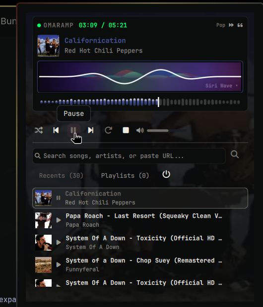

# Omaramp 📻

Native status bar retro music player controller and real-time audio visualizer for Omarchy.

Inspired by Winamp & [cliamp](https://github.com/brianstrauch/cliamp).

[](https://omarchyplugins.com)
[](LICENSE)



---

## 🌟 Features

- **Retro Winamp HUD**: Digital LED time counter (`01:23 / 03:45`), KBPS/Stereo badges, track marquee ticker, and smooth playhead scrubber.
- **37 Live Visualizer Styles**: Categorized selector featuring:
  - **Classic & VU**: Bars, Classic LED, Peaks, Columns, Bars Dot, Bars Outline, Bricks, Stereo VU, ASCII.
  - **Waves & Scopes**: Siri Wave (Apple iOS 9 algorithm), Sine Wave (standing acoustic harmonics), SoundCloud Wave (ultra-thin asymmetrical), Telegram Wave (voice capsule pills), DAW Peak Wave (RMS + True Peak dual-layer), LED Scrubber (discrete matrix blocks), Heatmap Wave (thermal energy gradient), Baseline Wave (grounded floor spectrum), XY Scope, Waveform, Heartbeat.
  - **Synth & Retro**: Retro Synth, Flame, Pulse, Matrix, Terrain, Binary, Logo, Mosaic.
  - **Particles & Nature**: Sand, Firework, Geyser, Firefly, Sakura, Bubbles, Rain, Butterfly, Scatter.
- **10-Band Equalizer & DSP Effects**:
  - 10-Band Pro EQ presets: *Flat, Bass Boost, Rock, Electronic, Pop, Vocal Clarity, Acoustic, Treble Boost, Late Night*.
  - **3D Spatial Audio Widener**: Binaural stereo expansion.
  - **EBU R128 Dynamic Loudness Normalizer**: Anti-earblast volume evening.
- **Synced Lyrics**: Live word-by-word synced lyrics powered by lrclib.net.
- **Streaming & YouTube Integration**:
  - Instant YouTube track search with auto-thumbnail prefetching.
  - Zero-disk FIFO streaming audio playback over secure private user runtime directory.
  - Direct Spotify track links (`open.spotify.com/track/...`) and playlist/album importer.
- **Queue Manager (Up Next)**: Interactive queue tab with reordering, queue count badges, and auto-play next.
- **Full Transport Deck**: Play/Pause, Next, Prev, Stop, Shuffle, Repeat, Volume slider, and Speed controls (0.5x–2.0x).
- **Keyboard Shortcuts**: `Space` (play/pause), `Left`/`Right` (seek), `Up`/`Down` (volume), `/` (search), `m` (mute), `Esc` (close).
- **Zero-Overhead Idle**: Sub-process sleep and lightweight PipeWire monitoring when paused or closed (~42 MB RAM, ~0.5% CPU playback).
- **Status Bar Widget**:
  - **Left Click**: Toggle popup player panel.
  - **Middle Click**: Instant Play/Pause toggle.
  - **Right Click**: Skip to next track.
  - **Mouse Wheel**: Smooth volume adjustment directly from the bar.

---

## 📦 External Dependencies

Omaramp requires the following packages for audio playback, PipeWire recording, spectrum processing, and media streaming:

| Dependency | Purpose | Package (Arch Linux) |
| :--- | :--- | :--- |
| `mpv` | Headless media playback engine & IPC socket control | `mpv` |
| `pipewire` | Real-time audio server and recording (`pw-record`) | `pipewire` / `pipewire-pulse` |
| `python-numpy` | Zero-copy C fast Fourier transform (FFT) spectrum calculations | `python-numpy` |
| `yt-dlp` | YouTube track search and audio streaming | `yt-dlp` |

### Install Dependencies:

```bash
omarchy pkg add mpv pipewire python-numpy yt-dlp
```

---

## 📥 Installation

Install Omaramp using the Omarchy CLI:

```bash
omarchy plugin add https://github.com/JoeJoeflyn/omaramp --enable
omarchy restart shell
```

### Manual Bar Configuration

Add `"omaramp"` to your desired status bar section in `~/.config/omarchy/shell.json`:

```jsonc
{
  "bar": {
    "sections": {
      "right": [
        "omaramp",
        "omarchy.audio",
        "omarchy.network",
        "omarchy.battery"
      ]
    }
  }
}
```

---

## 🗑️ Removal & Uninstallation

To disable and remove Omaramp from your system:

```bash
# 1. Remove plugin from Omarchy
omarchy plugin remove omaramp

# 2. (Optional) Clean up cached album art and history
rm -rf ~/.config/omarchy/plugins/omaramp ~/.cache/omaramp

# 3. Restart the desktop shell
omarchy restart shell
```

---

## ⌨️ Shell / IPC Commands

Control Omaramp from your terminal, scripts, or window manager hotkeys:

```bash
# Toggle player panel
omarchy-shell shell summon omaramp
omarchy-shell shell toggle omaramp

# Playback controls
omarchy-shell omaramp play
omarchy-shell omaramp pause
omarchy-shell omaramp toggle
omarchy-shell omaramp stop

# Navigation
omarchy-shell omaramp next
omarchy-shell omaramp prev

# Play a stream URL or YouTube link
omarchy-shell omaramp playUrl "https://www.youtube.com/watch?v=..."
```

---

## 📄 License

MIT License © 2026 JoeJoeflyn
